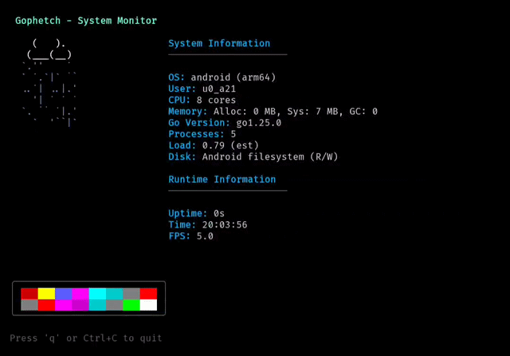

# Gophetch

A terminal-based system monitor with ASCII animation built in Go using Bubble Tea.



*Demo showing the animated rain cloud, color palette, and real-time system information.*

## Features

- Real-time system information display
- Animated rain cloud ASCII art
- Cross-platform compatibility (Windows, Linux, macOS, Android/Termux)
- Color palette with animated wave effects
- System metrics including CPU, memory, disk usage, and load average
- Responsive terminal UI with proper cleanup

## Requirements

- Go 1.25.1 or later
- Terminal with ANSI color support

## Installation

```bash
git clone <repository-url>
cd gophetch
go build
```

## Usage

```bash
# Run with default settings
./gophetch

# Run with custom frame rate
./gophetch 100ms

# Run with custom ASCII frames file
./gophetch frames.txt
```

## Controls

- `q` or `Ctrl+C` - Exit application

## System Information Displayed

- Operating system and architecture
- Username
- CPU core count
- Memory allocation and garbage collection stats
- Disk usage and permissions
- Process count
- Load average (estimated on Windows)
- Runtime information (uptime, FPS, Go version)

## Dependencies

- [Bubble Tea](https://github.com/charmbracelet/bubbletea) - Terminal UI framework
- [Lip Gloss](https://github.com/charmbracelet/lipgloss) - Styling library

## License

See [LICENSE](LICENSE) file for details.
